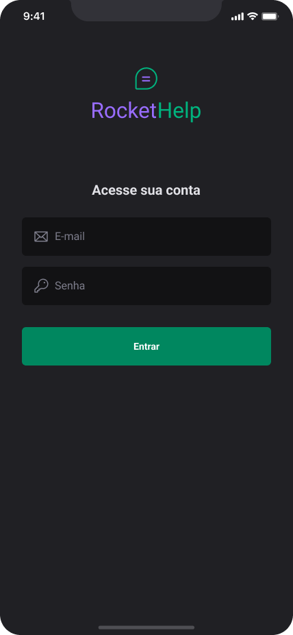

<h1 align="center">
    
</h1>

<h1>
    
</h1>

# Indice

- [Indice](#indice)
  - [🔖&nbsp; Sobre](#-sobre)
  - [🚀 Tecnologias utilizadas](#-tecnologias-utilizadas)
  - [🗂 Como baixar o projeto](#-como-baixar-o-projeto)

## 🔖&nbsp; Sobre

O projeto **RocketHelp** é um aplicativo android/ios desenvolvido com React Native que permite o usuário realizar solicitações de chamados ao suporte da sua empresa. Foi desenvolvido durante a semana Ignite Lab React Native. 

---

## 🚀 Tecnologias utilizadas

O projeto foi desenvolvido utilizando as seguintes tecnologias

- [ReactNative](https://reactjs.org)
- [Expo](https://expo.dev/)
- [NativeBase](https://nativebase.io/)
- [PhosphorIcon](https://phosphoricons.com/)
- [Firebase](https://firebase.google.com/)

---

## 🗂 Como baixar o projeto

```bash

    # Clonar o repositório
    $ git clone https://github.com/rogerioopaiva/rockethelp

    # Entrar no diretório
    $ cd rockethelp

    # Instalar as dependências
    $ yarn install

    # Iniciar o projeto
    $ expo start
```

---

<p align="center">Desenvolvido  por Rogerio Paiva</p>